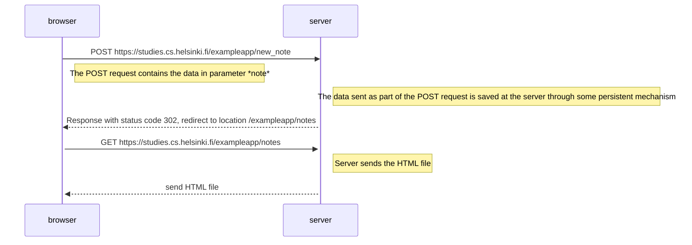

```mermaid
sequenceDiagram
    participant browser
    participant server
    
    browser->>server: POST https://studies.cs.helsinki.fi/exampleapp/new_note
    Note right of browser: The POST request contains the data in parameter *note*
    activate server
    Note right of server: The data sent as part of the POST request is saved at the server through some persistent mechanism
    server-->>browser: Response with status code 302, redirect to location /exampleapp/notes 
    activate browser
    browser->>server: GET https://studies.cs.helsinki.fi/exampleapp/notes
    activate server
    Note right of server: Server sends the HTML file
    server-->>browser: send HTML file
    activate browser
    
```
