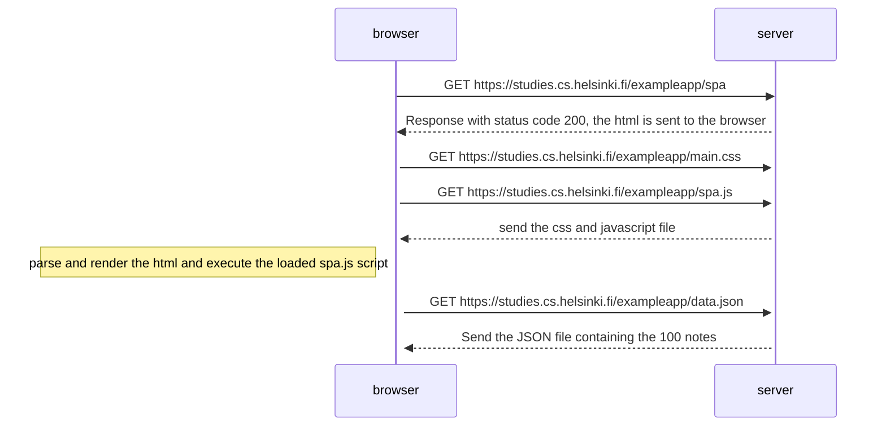

```mermaid
sequenceDiagram
    participant browser
    participant server
    
    browser->>server: GET https://studies.cs.helsinki.fi/exampleapp/spa
    activate server
    server-->>browser: Response with status code 200, the html is sent to the browser
    activate browser
    browser->>server: GET https://studies.cs.helsinki.fi/exampleapp/main.css
    browser->>server: GET https://studies.cs.helsinki.fi/exampleapp/spa.js   
    activate server
    server-->>browser: send the css and javascript file
    activate browser
    Note left of browser: parse and render the html and execute the loaded spa.js script
    browser->>server: GET https://studies.cs.helsinki.fi/exampleapp/data.json
    activate server
    server-->>browser: Send the JSON file containing the 100 notes
```
