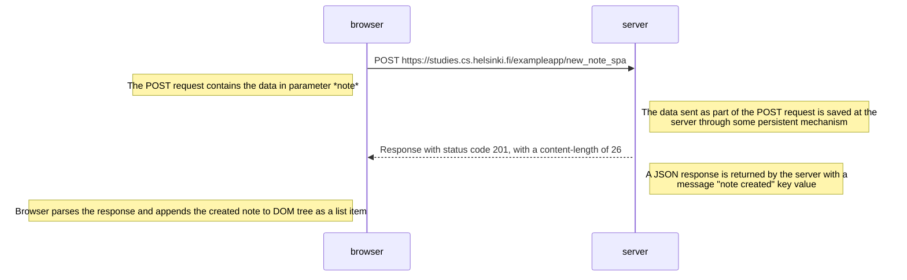

```mermaid
sequenceDiagram
    participant browser
    participant server
    
    browser->>server: POST https://studies.cs.helsinki.fi/exampleapp/new_note_spa
    Note left of browser: The POST request contains the data in parameter *note*
    activate server
    Note right of server: The data sent as part of the POST request is saved at the <br/> server through some persistent mechanism
    server-->>browser: Response with status code 201, with a content-length of 26
    Note right of server: A JSON response is returned by the server with a <br/> message "note created" key value
    activate browser
    Note left of browser: Browser parses the response and appends the created note to DOM tree as a list item
   
```
